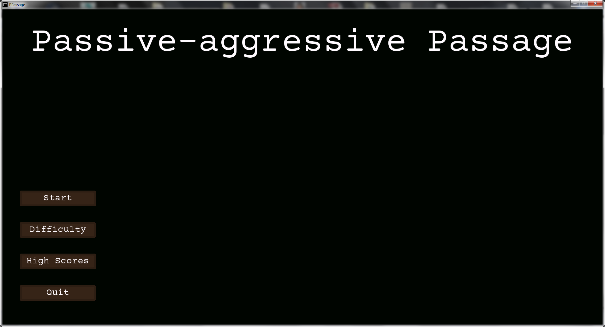

# Passive-aggressive Passage

Zasady na podstawie gry 'Passage 3' produkcji GEKKO Software GmbH:

- po prawej stronie ekranu widać następny kafelek do położenia
- kafelki kładzie się kliknięciem lewego przycisku myszy
- kafelki można układać tylko obok innych kafelków położonych wcześniej na planszy
- sąsiadujące kafelki muszą zgadzać się kolorem lub wzorem
- obok ciemnoszarego kalfelka można położyć dowolny kafelek
- jeśli nie ma opcji położenia kafelka, można go pominąć klikając prawym przyciskiem myszy
- kafelek z ikona kosza oznacza, że można usunąć któryś z położonych wcześniej kafelków
- zły ruch lub pominięcie kafelka, który był możliwy do położenia skutkuje stratą kredytów
- ułożenie pełnego wiersza lub kolumny dodaje premię punktową
- dostępne są 2 tryby rozgrywki: 'Classic' i 'Continuous' i 3 poziomy trudności: 'Easy', 'Medium' i 'Hard'
- w trybie 'Classic' gra kończy się po ułożeniu na planszy 72 kafelków, po ułożeniu pełnego rzędu lub kolumny kafelki NIE znikają
- w trybie 'Continuous' kafelki są nieskończone, po ułożeniu pełnego rzędu lub kolumny kafelki znikają
- poziomy trudności różnią się ilością dostępnych kredytów, jest to odpowiednio 40, 30 i 20 dla 'Easy', 'Medium' i 'Hard' 

Projekt wykonany z wykorzystaniem Pythona 3.4 oraz PyGame 1.9.2a0 dla Pythona 3.4 w celu nauki tych technologii.

#
Katalog z plikami wykonywalnymi dostępny tutaj: 
https://my.pcloud.com/publink/show?code=XZvdsQ7ZjQT0py0Fe2SvXQO6QfVLFHotNIYX

Instrukcja: wypakuj plik zip i uruchom main.exe 
