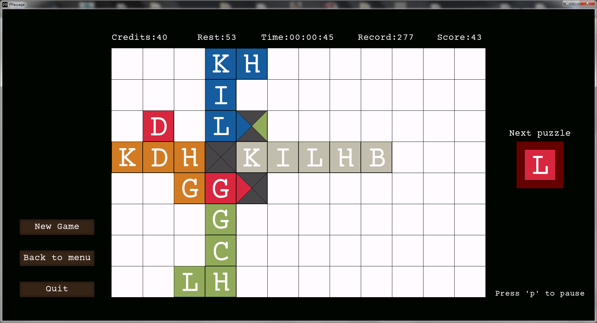
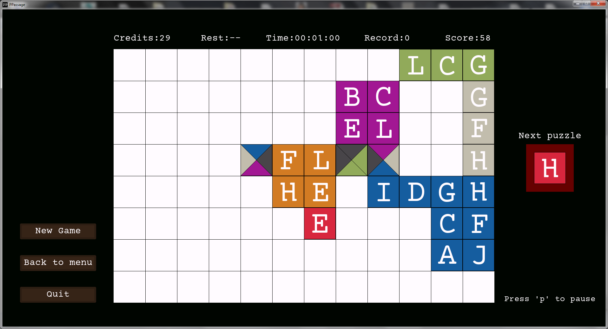

# Passive-aggressive Passage

Zasady na podstawie gry 'Passage 3' produkcji GEKKO Software GmbH:

- po prawej stronie ekranu widać następny kafelek do położenia
- kafelki kładzie się kliknięciem lewego przycisku myszy
- kafelki można układać tylko obok innych kafelków położonych wcześniej na planszy
- sąsiadujące kafelki muszą zgadzać się kolorem lub wzorem
- obok ciemnoszarego kalfelka można położyć dowolny kafelek
- jeśli nie ma opcji położenia kafelka, można go pominąć klikając prawym przyciskiem myszy
- kafelek z ikona kosza oznacza, że można usunąć któryś z położonych wcześniej kafelków
- zły ruch lub pominięcie kafelka, który był możliwy do położenia skutkuje stratą kredytów
- ułożenie pełnego wiersza lub kolumny dodaje premię punktową
- dostępne są 2 tryby rozgrywki: 'Classic' i 'Continuous' i 3 poziomy trudności: 'Easy', 'Medium' i 'Hard'
- w trybie 'Classic' gra kończy się po ułożeniu na planszy 72 kafelków, po ułożeniu pełnego rzędu lub kolumny kafelki NIE znikają
- w trybie 'Continuous' kafelki są nieskończone, po ułożeniu pełnego rzędu lub kolumny kafelki znikają
- poziomy trudności różnią się ilością dostępnych kredytów, jest to odpowiednio 40, 30 i 20 dla 'Easy', 'Medium' i 'Hard' 

Projekt wykonany z wykorzystaniem Pythona 3.4 oraz PyGame 1.9.2a0 dla Pythona 3.4 w celu nauki tych technologii.

#
Katalog z plikami wykonywalnymi dostępny tutaj: 

https://my.pcloud.com/publink/show?code=XZvdsQ7ZjQT0py0Fe2SvXQO6QfVLFHotNIYX

Instrukcja: wypakuj plik zip i uruchom main.exe 

#
Rules based on the 'Passage 3' game from GEKKO Software GmbH:

- on the right side of the screen you can see the next tile for placing
- tiles are placed by clicking the left mouse button
- tiles can be placed only next to other tiles previously placed on the board
- adjacent tiles must match the color or pattern
- any tile can be placed next to the dark gray tile
- if there is no option for placing tile, you can skip it by right-clicking
- a tile with the recycle bin icon means you can remove any of the tiles previously located
- a bad move or omission of a tile that could be put in place results in a loss of credit
- placing a full row or column adds a point bonus
- 2 game modes are available: 'Classic' and 'Continuous' and 3 levels of difficulty: 'Easy', 'Medium' and 'Hard'
- in 'Classic' mode, the game ends after 72 tiles have been placed on the board, after completing the full row or column, the tiles DO NOT disappear
- in 'Continuous' mode, the tiles are infinite, after laying a full row or column, the tiles disappear
- difficulty levels differ in the number of available credits, 40, 30 and 20 respectively for 'Easy', 'Medium' and 'Hard'

Project made using Python 3.4 and PyGame 1.9.2a0 for Python 3.4  in order to learn about these technologies.

Catalog with executable files available here:

https://my.pcloud.com/publink/show?code=XZvdsQ7ZjQT0py0Fe2SvXQO6QfVLFHotNIYX

Instructions: extract the zip file and run main.exe